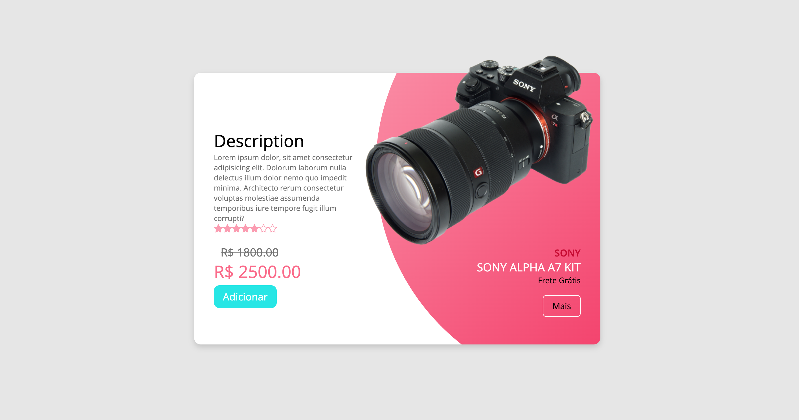

# Sign Up Screen

<h1>
	
</h1>

## Tecnologias

Este projeto foi desenvolvido utilizando as seguintes tecnologias:

- [React]()
- [Javascript]()
- [SCSS]()

## Instalação e uso

Clone o repositório

```bash
$ git clone https://github.com/deniscoelho-js/ecommerce-camera.git

```

Siga os passos abaixo

```bash
# Instale as dependências
$ npm i or yarn

# Inicie o servidor
$ npm run dev or yarn dev
```

Agora você pode acessar [`localhost:3000`](http://localhost:3000) do seu navegador.
